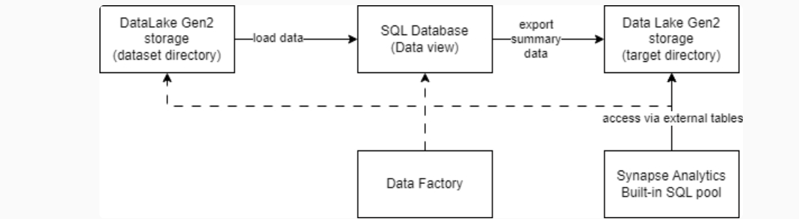
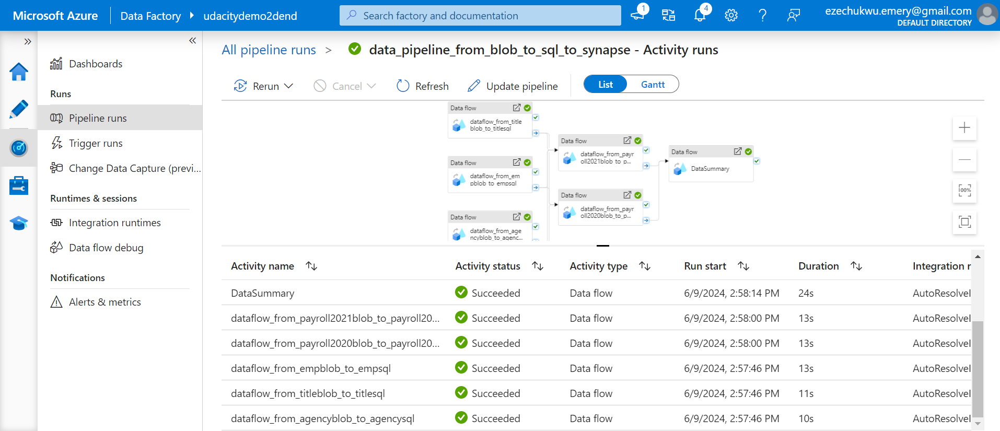
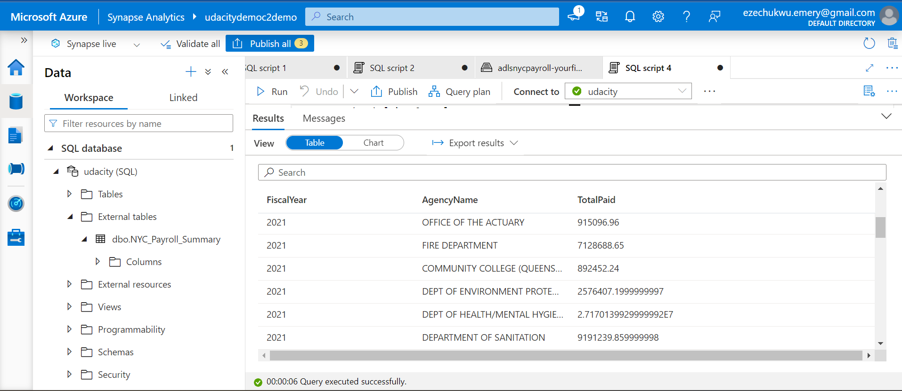
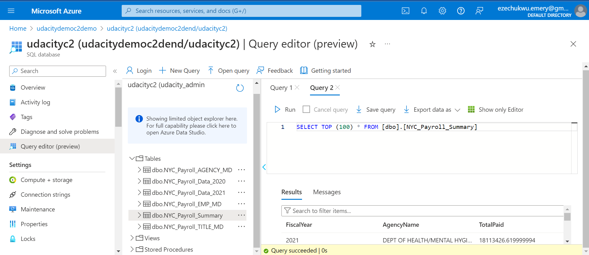
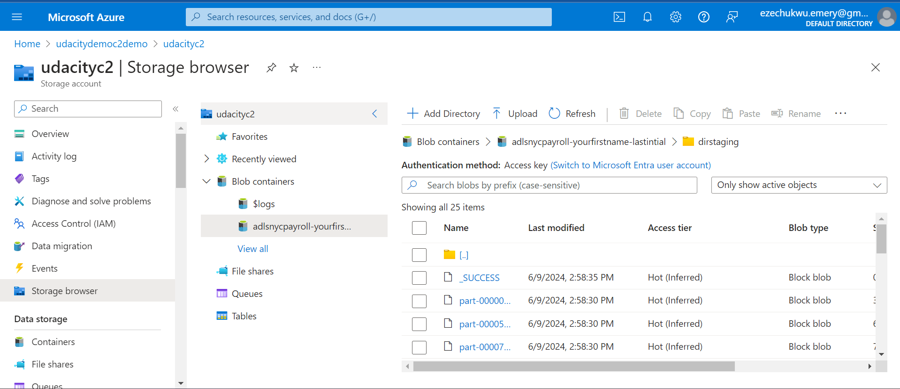

# Azure DataWareHouse Project

The City of New York would like to develop a Data Analytics platform on Azure Synapse Analytics to accomplish two primary objectives:

Analyze how the City's financial resources are allocated and how much of the City's budget is being devoted to overtime.
Make the data available to the interested public to show how the City’s budget is being spent on salary and overtime pay for all municipal employees.
You have been hired as a Data Engineer to create high-quality data pipelines that are dynamic, can be automated, and monitored for efficient operation. The project team also includes the city’s quality assurance experts who will test the pipelines to find any errors and improve overall data quality.

The source data resides in Azure Data Lake and needs to be processed in a NYC data warehouse. The source datasets consist of CSV files with Employee master data and monthly payroll data entered by various City agencies.

### The goal of this project is to develop a Data Integration Pipelines on the NYC Payroll Data.

* Pipeline Overview;

* Data Factory Pipeline deployment;

* Pipeline deployment success in azure synapse;

* Pipeline deployment success in Azure SQL DB;

* Pipeline deployment success in Azure data lake;

